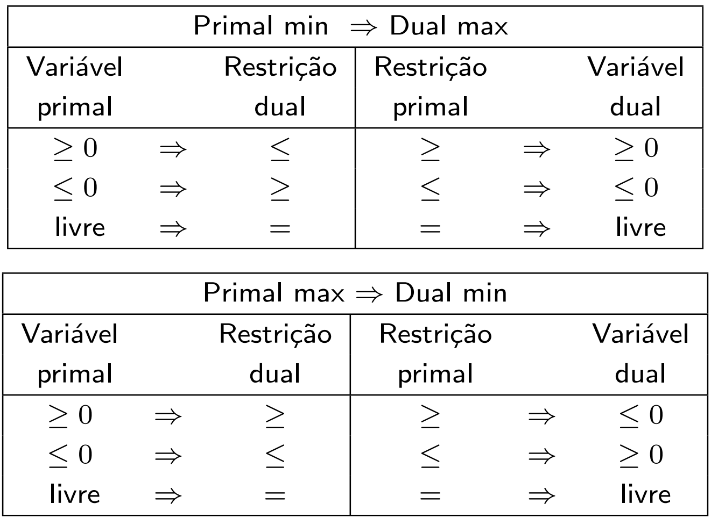

# Motivation and economic interpretation

## Remembering the alloy problem

**Let us remember the alloy problem:**

A metallurgical plant produces two types of metallic alloys. Each alloy is composed of different proportions of copper, zinc and lead, which are available in limited quantities from stock. It is desired to determine how much to produce of each metallic alloy, in order to maximize the gross revenue, satisfying the following compositions of the alloys and the availability of raw materials in stock:

| Raw material                   | Alloy 1 | Alloy 2 | Stock |
|--------------------------------|---------|---------|-------|
| Copper                         | 50%     | 30%     | 3 ton |
| Zinc                           | 10%     | 20%     | 1 ton |
| Lead                           | 40%     | 50%     | 3 ton |
| Sale price (x1000 R\$ per ton) | 3       | 2       |       |

Modeling this problem we get:

## The alloy problem LP model

Let $x_i:=$ the quantity of tons of alloy $i$ to be produced, $i \in \{1,2\}$.

FO:

$$ \max F = 3x_1 + 2x_2 $$

subject to: $$ 0.5x_1 + 0.3x_2 \le 3$$ $$0.1x_1 + 0.2x_2 \le 1$$ $$0.4x_1 + 0.5x_2 \le 3$$ $$x_1 \ge 0, x_2 \ge 0$$

This model known as the natural model also is known as ***the primal model***.

**Exercise**: Solve the alloy problem by using the simplex method.

# The dual problem and its economic interpretation of duality

Let us consider there is a friend company that is asking us to sell them the stocks of our raw materials. What are the minimum 'fare' prices for us to access to do the business?

To achieve that we have to clarify what is the fare deal. So, we can define that the 'fare' prices must accomplish the following conditions:

-   We have to make sure that the stocks sold produce the same income as if we used these raw materials to make the alloys.

-   This mean, the total income must include the benefit of produce and sell the alloys.

-   Prices have to be calculated according to the importance of the raw materials.

-   The deal for our friend company is they will purchase all the stocks as a package, not individual ones.

## The dual problem: model formulation.

-   Let $p_j$ the 'fare' price per ton sold of the raw material $j$, $j \in \{\text{1(Copper), 2(Zinc), 3(Lead)}\}$.

-   OF: $$\min \text{Total_income}_{\text{(RM stocks selling)}}= \underbrace{3p_{1}}_{\text{Income for Copper sold stock}} + \underbrace{1p_{2}}_{\text{Income for Zinc sold stock}} + \underbrace{3p_{3}}_{\text{Income for Lead sold stock}}$$

-   The firs constraint is related to ensure the income due to the first alloy as minimal income (\$ 3mil per ton) (proporcionally). $$\underbrace{0.5p_1}_{\text{Proportional income due to Copper use in alloy 1}} +\underbrace{0.1p_2}_{\text{Proportional income due to Zinc use in alloy 1}} +\underbrace{0.4p_3}_{\text{Proportional income due to Lead use in alloy 1}} \ge \underbrace{3}_{\text{Income per ton of alloy 1}}$$

-   The second constraint is related to ensure the income due to the second alloy as minimal income (\$2 mil per ton) (proporcionally). $$\underbrace{0.3p_1}_{\text{Proportional income due to Copper use in alloy 2}} +\underbrace{0.2p_2}_{\text{Proportional income due to Zinc use in alloy 2}} +\underbrace{0.5p_3}_{\text{Proportional income due to Lead use in alloy 2}} \ge \underbrace{2}_{\text{Income per ton of alloy 2}} $$

-   Last, we want all these prices be positive (or zero). $$p_1\ge0, p_2\ge0, p_3\ge0$$

## The complete dual model

$$\min \text{Total_income}_{\text{(RM stocks selling)}}= 3p_{1} + p_{2} + 3p_{3}$$ Subject to: $$0.5p_1 +0.1p_2 +0.4p_3 \ge 3$$

$$0.3p_1 +0.2p_2 +0.5p_3 \ge 2 $$ $$p_1\ge0, p_2\ge0, p_3\ge0$$ This is called **the dual model**\*.

Exercise: solve the **dual problem**. Compare the solution with the **primal problem** solution.

## Characteristics of the pair primal-dual

-   The dual problem offers a complementary and/or alternative way of seeing the *primal* problem.

-   It focuses on determine the value of the 'resources' due to their 'shortage' instead of the quantities of 'final products' that maximize some income.

-   The obtention of the dual problem of the dual problem returns the primal problem again.

-   There is just one dual problem for each primal and one primal for each dual.

-   The global OF value of the optimal solution for both problems is the same value.

-   The dual is another LP, it can be solved by the methods we already know.

-   For the solution:

    -   If one problem (whatever) is unbounded, the other will be unfeasible.

    -   If one problem (whatever) is unfeasible, the other will be unfeasible or unbounded.

# The primal-dual table conversion

The dual problem of the primal problem is a conclusion that comes from the Lagrangean theory of optimization for linear models.

It is possible to arrive to the dual from the primal just applying the Lagrangean theory of optimization. But memorizing this steps is not trivial. Fortunately for us there is a shorter path.

Passing from the primal model to the dual model is easy with the following conversion table:

*Starting from a primal minimization problem:*

|                 | Primal min |                 | $\implies$ |                   | Dual max   |               |
|-----------------|------------|-----------------|------------|-------------------|------------|---------------|
| Primal variable |            | Dual constraint |            | Primal constraint |            | Dual variable |
| $\ge 0$         | $\implies$ | $\le$           |            | $\ge$             | $\implies$ | $\ge 0$       |
| $\le 0$         | $\implies$ | $\ge$           |            | $\le$             | $\implies$ | $\le 0$       |
| free            | $\implies$ | $=$             |            | $=$               | $\implies$ | free          |

*Starting from a primal maximization problem:*

|                 | Primal max |                 | $\implies$ |                   | Dual min   |               |
|-----------------|------------|-----------------|------------|-------------------|------------|---------------|
| Primal variable |            | Dual constraint |            | Primal constraint |            | Dual variable |
| $\ge 0$         | $\implies$ | $\ge$           |            | $\ge$             | $\implies$ | $\le 0$       |
| $\le 0$         | $\implies$ | $\le$           |            | $\le$             | $\implies$ | $\ge 0$       |
| free            | $\implies$ | $=$             |            | $=$               | $\implies$ | free          |

## Excercise:

Get the dual problem from the following primal problems:

| 1\. $$ \max F = 3x_1 + 2x_2 $$         | 2\. $$ \min F = 15x_1 + 12x_2 $$  | 3\. $$ \min F = 5x_1 + 12x_2 + 4x_3 $$ |
|----------------------------------------|-----------------------------------|----------------------------------------|
| subject to: $$ 0.5x_1 + 0.3x_2 \le 3$$ | subject to: $$ x_1 + 2x_2 \ge 3$$ | $$x_1 + 2x_2 + 3x_3 \le 10$$           |
| $$0.1x_1 + 0.2x_2 \le 1$$              | $$2x_1 - 4x_2 \le 5$$             | $$2x_1 - x_2 + 3x_3 = 8$$              |
| $$0.4x_1 + 0.5x_2 \le 3$$              | $$x1 \ge 0, x2 \ge 0$$            | $$x_1\ge0, x_2\ge0, x_3 \ge0$$         |
| $$x1 \ge 0, x2 \ge 0$$                 |                                   |                                        |

<!-- ::: notes -->

<!-- This is a speaker note. -->

<!-- 1.  -->

<!-- 2. $$\max G = 3p_1 + 5p_2$$  -->

<!-- s.t.: $$p_1 + 2p_2 \le 15$$ -->

<!-- $$2p_1 - 4p_2 \le 12$$ -->

<!-- $$p_1 \ge 0, p_2 \le 0$$ -->

<!-- ::: -->

<!--  -->

## Importance of the duality

1.  Fundamental concept in optimization!

2.  It may be easier to solve the dual problem than the primal problem

3.  Another perspective for the simplex method (dual simplex)

4.  Economic interpretation

5.  Dual simplex

6.  ***Sensitivity analysis***

## Overview of the duality theory

Dual theory is a result of the application of the Lagrange multiplier method to linear problems, often used in calculus to minimize a function subject to equality constraints.

For example, consider:

$$\min F(x,y) = x^2 +y^2$$ Subject to: $$x + y = 1$$

We can relax the problem by inserting the constraint into the OF with a penalty $p$ (This is a Lagrange's multiplier): $$\min L(x,y,p) = x^2+y^2 +p(1-x-y)$$ Considering a fixed p, we can determine the minimum of the function $L$. By partially derivating L with respect to $x$ and $y$ and setting this derivatives to $0$.

$$\frac{\partial L}{\partial x} = 2x - p  = 0 \implies x=\frac{p}{2}$$ $$\frac{\partial L}{\partial y} = 2y - p  = 0 \implies y=\frac{p}{2}$$

The original constraint $x+y=1$ result in $\frac{p}{2}+\frac{p}{2} = 1$, which means $p=1$. And the optimal solution of $F$ is $x=1/2$, $y=1/2$.

This procedure can be applied to LP problems. We add this penalties $p_i$, one $p$ for each constraint and we can find the optimal values of this penalties by solving another LP problem called the ***Dual Problem***.

## Further reading on the duality theory

For a deeper introduction, motivation and analytic view of the duality theory, please refer to the following readings:

-   Chapter 4, Sections 4.1 and 4.2 (Bertsimas and Tsitsiklis, 1997).

-   Section 2.10 (Arenales et al. 2014). OBS: in this book $p\equiv\lambda$.

# An overview of the Dual Simplex method

It is a method that allow to solve the primal problem by using the duality theory. The version of the simplex seen until now is called the ***Primal Simplex***.

It starts from the Karush Kunh Tucker conditions and it is based on the primal simplex.

In the primal simplex we start from $x_{\mathcal{B}}\ge0$ and we are worried to achieve $s_{\mathcal{N}}$ be $\ge0$ to get the optimal solution.

-   We start from a **feasible basic primal solution**.

-   We allow dual unfeasible solutions ($s_{\mathcal{N}}<0$) on the iterations.

-   We **stop** when all $s_{\mathcal{N}}\ge0$.

For the dual simplex we start from $s_j\ge0$ and we want to ensure $x_{\mathcal{B}}\ge0$ to get the optimal solution.

-   We start from a **feasible basic dual solution**.

-   We allow dual unfeasible solutions ($x_{\mathcal{B}}<0$) on the iterations.

-   We **stop** when all $x_{\mathcal{B}}\ge0$.

**Advantages of the dual simplex**

-   It allows to start from an unfeasible primal solution.

-   The initialization of the dual simplex method is easier than the primal simplex method.

-   It allows to add new constraints\* easily.

-   While at any iteration of the primal simplex we can know just if the problem is un bounded, the dual offers us to know if the primal problem is unfeasible.

-   It allows to detect unfeasibility in the problem: :-)

-   Unconvenient\*: it allows unfeasible primal solutions.

## The dual simplex algorithm

***input***: $\mathcal{B}, \mathcal{N}$ such as $B= A_\mathcal{B}$ is invertible and $s_j = c_j - p^Ta_j\ge0 \quad \forall j \in \mathcal{N}$ (\*). If condition (\*) is not satisfied we must initialize the method.

1.  Calculate the basic solution: $\bar{x}_{\mathcal{B}} = B^{-1}b$

2.  Determine $\bar{x}_{\mathcal{B}_l} = \min_{i \in \mathcal{B}}(\bar{x}_{\mathcal{B}_i})$ (the most negative value)

3.  If $\bar{x}_{\mathcal{B}_i}\ge0 \quad \forall i \in \mathcal{B}$ then **STOP**, the optimal solution was found.

Else, $\bar{x}_{\mathcal{B}_l}$ will leave the base.

4.  Calculate the the basic dual solution: $\bar{p}^T = c^T_{\mathcal{B}}B^{-1}$, $s_j = c_j - p^Ta_j \quad \forall j \in \mathcal{N}$

5.  Calculate $\eta^T = [e]_lB^{-1}$

6.  If $\eta^Ta_j\ge0 \forall j \in \mathcal{N}$ then **STOP**, the problem is unfeasible *(This is because the dual problem is unbounded).*

7.  Dual ratio test: $$\frac{\bar{s}_k}{-\eta^Ta_k} = \min_{j \in \mathcal{N}}\big\{\frac{\bar{s}_j}{-\eta^Ta_j}|\eta^Ta_j<0 \big\}$$;

$\bar{x}_k$ will enter the base.

8.  Update $\mathcal{B}, \mathcal{N}$ and get back to step 1.

## Initialization

For the dual problem to be feasible, the primal should be **limited**. So we should add a new dummy constraint to create an upper bound to all non-basic variables.

$$\sum_{j \in \mathcal{N}}x_i\le M$$ Observe that by limiting the non-basic variables we limit the basic varibles as well.

So the modified problem then remains:

$$\min c^Tx$$ S.t.: $$Ax=b$$ $$\color{blue} {\sum_{j \in \mathcal{N}} x_i\le M}$$ $$x\ge0$$

When standardized, we have:

$$\min c^Tx$$ S.t.: $$Ax=b$$ $$\sum_{j \in \mathcal{N}}x_i+x_{n+1} = M$$ $$x, x_{n+1}\ge0$$

Whose dual version is:

$$\max b_1p_1 +\ldots+b_mp_m + Mp_{m+1}$$ S.t. $$A^Tp + \mathbf{p}_{m+1} + s = c$$ $$p_{m+1}\le0$$ $$s\ge0$$ Transforming into the standard form, we have:

$$\max b_1p_1 +\ldots+b_mp_m - Mp_{m+1}$$ S.t. $$A^Tp - \mathbf{p}_{m+1} + s = c$$ $$q, s\ge0$$ Now we can stablish a new base, which has the same size as $\mathcal{B}$ plus one (+1): $|\tilde{\mathcal{B}}| = \mathcal{B}$.

Observe that, in this new base, $s_j = c_j - (p,p_{m+1})^T(a_j,1)$,, or, in general: $$\tilde{S}^T = c^T_{\mathcal{N}} - \begin{bmatrix}p^T & p_{m+1}\end{bmatrix}\begin{bmatrix}N \\ \mathbf{1}\end{bmatrix}$$ $$\tilde{S}^T = c^T_{\mathcal{N}} - p^TN - p_{m+1}$$ $$\tilde{S}^T = S^T - p_{m+1}$$ If we choose the most negative $s_j$ in $S$ (let us call it $s_k$), anď we do $p_{m+1} = s_k$, then all the $s$ in $S$ will become $\ge 0$, as we desire.

Then the initial base remains as: $$\tilde{\mathcal{B}} = \mathcal{B}\cup k, \tilde{\mathcal{N}} = N\backslash k \cup \{n+1\}$$ Like that, the new base $\tilde{\mathcal{B}},\tilde{\mathcal{N}}$ makes the dual initial solution be feasible and we can start the dual simplex.

## Example

Solve via dual simplex: $$\min f(x) = x_1 + 12x_2 − 3x_3 + 4x_4$$ s.a $$x_1 + 3x_2 − 2x_3 − 2x_4 ≥ 2$$ $$−x_1 + 2x2 − 3x3 + 3x4 ≥ 1$$ $$x_1, . . . , x_4 ≥ 0$$

**Solution**

In the standard form: $$\min f(x) = x_1 + 12x_2 − 3x_3 + 4x_4 +0x_5 +0x_6$$ s.a $$x_1 + 3x_2 − 2x_3 − 2x_4 -x_5 \quad = 2$$ $$−x_1 + 2x2 − 3x3 + 3x4 \quad -x_6 = 1$$ $$x_1, . . . , x_6 ≥ 0$$ The obtained matrices are: $$c^T = \begin{bmatrix}1&12&-3&4&0&0\end{bmatrix}$$ $$A= \begin{bmatrix}1&3&-2&-2&-1&0\\-1&2&-3&3&0&-1\end{bmatrix}, b =\begin{bmatrix}2\\1\end{bmatrix}$$

Let us consider the base $\mathcal{B} = \{4,5\}, \mathcal{N} = \{1,2,3,4\}$. This implies: $$B = B^{-1} \begin{bmatrix}-1&0\\0&-1\end{bmatrix}$$ The basic solution is: $$x_{\mathcal{B}} =B^{-1}b = \begin{bmatrix}-1&0\\0&-1\end{bmatrix}\begin{bmatrix}2\\1\end{bmatrix} = \begin{bmatrix}-2\\-1\end{bmatrix}$$ This base will not be possible in the primal simplex method, but is totally normal in the dual simplex.

***NOTE*** In fact if $x_{\mathcal{B}}\ge0$ and the dual feasibility conditions were respected we would be in front of the optimal solution.

Let us examine the dual feasibility conditions:

$$S = c^T_{\mathcal{N}} - p^TN = \begin{bmatrix}1 & 12 & -3 & 4\end{bmatrix} - \begin{bmatrix}0&0\end{bmatrix}\begin{bmatrix}-1&0\\0&-1\end{bmatrix}\begin{bmatrix}1&3&-2&-2\\-1&2&-3&3\end{bmatrix}$$ $$S = \begin{bmatrix}1 & 12 & -3 & 4\end{bmatrix} - \begin{bmatrix}0&0\end{bmatrix}\begin{bmatrix}1&3&-2&-2\\-1&2&-3&3\end{bmatrix}$$ $$S = \begin{bmatrix}1 & 12 & -3 & 4\end{bmatrix} - \begin{bmatrix}0&0&0&0\end{bmatrix}$$ $$S = \begin{bmatrix}1 & 12 & -3 & 4\end{bmatrix}$$ We can see not all the reduced costs accomplish the dual feasibility conditions. By so, **we cannot start the dual simplex**.

Now we have to initialize the dual simplex.

We add the new constraint $\sum_{j \in \mathcal{N}}x_i\le M$:

$$\min f(x) = x_1 + 12x_2 − 3x_3 + 4x_4 +0x_5 +0x_6 + \color{blue}{0x_7}$$ s.a $$x_1 + 3x_2 − 2x_3 − 2x_4 -x_5 \quad \quad= 2$$ $$−x_1 + 2x2 − 3x3 + 3x4 \quad -x_6 \quad = 1$$ $$\color{blue}{x_1 + x_2 + x_3 + x_4 + 0x_5 + 0x_6 +x_7 = M}$$ $$x_1, . . . , x_6, \color{blue}{x_7} ≥ 0$$ As $s_3$ was the most negative, we can build the new base: $$\tilde{\mathcal{B}} = \mathcal{B}\cup k, \tilde{\mathcal{N}} = N\backslash k \cup \{n+1\} \implies \tilde{\mathcal{B}} = \{5,6,{\color{blue} 3}\}, \tilde{\mathcal{N}} = \{1,2,4,{\color{blue} 7}\}$$

With this base, we have:

$$c^T = \begin{bmatrix}1&12&-3&4&0&0&\color{blue}0\end{bmatrix}$$ $$A= \begin{bmatrix}1&3&-2&-2&-1&0&\color{blue}0\\-1&2&-3&3&0&-1&\color{blue}0\\1&1&1&1&0&0&\color{blue}1\end{bmatrix}, b =\begin{bmatrix}2\\1\\\color{blue}{100}\end{bmatrix}$$

The basic solution is: $$x_{\mathcal{B}} =B^{-1}b = \begin{bmatrix}-1&0&-2\\0&-1&-3\\0&0&1\end{bmatrix}\begin{bmatrix}2\\1\\100\end{bmatrix} = \begin{bmatrix}-202\\-301\\100\end{bmatrix}= \begin{bmatrix}x_5\\x_6\\x_3\end{bmatrix}$$

Let us examine the dual feasibility conditions:

$$S = c^T_{\mathcal{N}} - p^TN = \begin{bmatrix}1 & 12 & 4 & 0\end{bmatrix} - \begin{bmatrix}0&0&-3\end{bmatrix}\begin{bmatrix}-1&0&-2\\0&-1&-3\\0&0&1\end{bmatrix}\begin{bmatrix}1&3&-2&0\\-1&2&3&0\\1&1&1&1\end{bmatrix}$$ $$S = \begin{bmatrix}1 & 12 & 4 &0\end{bmatrix} - \begin{bmatrix}0&0&-3\end{bmatrix}\begin{bmatrix}1&3&-2&0\\-1&2&3&0\\1&1&1&1\end{bmatrix}$$ $$S = \begin{bmatrix}1 & 12 & 4 &0\end{bmatrix} - \begin{bmatrix}-3&-3&-3&-3\end{bmatrix}$$ $$S = \begin{bmatrix}4 & 15 & 7 & 3\end{bmatrix}$$ Note that all $s_j$ are positive. ***Now we can start the dual simplex***.

## The dual simplex algorithm live action

**Iteration 1**

$$\mathcal{B} = \{5,6,3\}, \mathcal{N} = \{1,2,4,7\}$$

1.  Calculate basic solution: $x_{\mathcal{B}} =B^{-1}b \implies x_{\mathcal{B}}^T = \begin{bmatrix}-202&\color{red}{-301}&100\end{bmatrix}$

2.  Exit variable: $\bar{x}_{\mathcal{B}_l} = \min_{i \in \mathcal{B}}(\bar{x}_{\mathcal{B}_i}) \implies x_6$ will leave the base.

3.  We must continue, there are $x_{\mathcal{B}_i} < 0$.

4.  Dual solution: $\bar{p}^T = c^T_{\mathcal{B}}B^{-1} = \begin{bmatrix}0&0&-3\end{bmatrix}$, $s_j = c_j - p^Ta_j \quad \forall j \in \mathcal{N} = \begin{bmatrix}1&12&4&0\end{bmatrix}$

5.  Preparation for Dual MRT: $\eta^T = [e]_lB^{-1} = \begin{bmatrix}0&-1&-3\end{bmatrix}$

6.  We must continue, there are negative denominators, so the problem is not unfeasible.

7.  Dual MRT: $\frac{\bar{s}_k}{-\eta^Ta_k} = \min_{j \in \mathcal{N}}\big\{\frac{\bar{s}_j}{-\eta^Ta_j}|\eta^Ta_j<0 \big\} = \{2,3,1.1\bar6,\color{blue}1\} \implies x_7$ will enter to the base.

8.  Base updating: $\mathcal{B} = \{5,\color{blue}7,3\}, \mathcal{N} = \{1,2,4,\color{red}6\}$

**Iteration 2**

$$\mathcal{B} = \{5,7,3\}, \mathcal{N} = \{1,2,4,6\}$$

1.  Calculate basic solution: $x_{\mathcal{B}} =B^{-1}b \implies x_{\mathcal{B}}^T = \begin{bmatrix}\color{red}{-1.\bar3}&100.\bar3&-0.\bar3\end{bmatrix}$

2.  Exit variable: $\bar{x}_{\mathcal{B}_l} = \min_{i \in \mathcal{B}}(\bar{x}_{\mathcal{B}_i}) \implies x_5$ will leave the base.

3.  We must continue, there are $x_{\mathcal{B}_i}<0$.

4.  Dual solution: $\bar{p}^T = c^T_{\mathcal{B}}B^{-1} = \begin{bmatrix}2&1&100\end{bmatrix}$, $s_j = c_j - p^Ta_j \quad \forall j \in \mathcal{N} = \begin{bmatrix}2&10&1&1\end{bmatrix}$

5.  Preparation for Dual MRT: $\eta^T = [e]_lB^{-1} = \begin{bmatrix}-1&0.\bar6&0\end{bmatrix}$

6.  We must continue, there are negative denominators, so the problem is not unfeasible.

7.  Dual MRT: $\frac{\bar{s}_k}{-\eta^Ta_k} = \min_{j \in \mathcal{N}}\big\{\frac{\bar{s}_j}{-\eta^Ta_j}|\eta^Ta_j<0 \big\} = \{\color{blue}{1.2},6,\infty,1.5\} \implies x_1$ will enter to the base.

8.  Base updating: $\mathcal{B} = \{\color{blue}1,7,3\}, \mathcal{N} = \{\color{red}5,2,4,6\}$

**Iteration 3**

$$\mathcal{B} = \{1,7,3\}, \mathcal{N} = \{5,2,4,6\}$$

1.  Calculate basic solution: $x_{\mathcal{B}} =B^{-1}b \implies x_{\mathcal{B}}^T = \begin{bmatrix}0.8&99.8&\color{red}{-0.6}\end{bmatrix}$

2.  Exit variable: $\bar{x}_{\mathcal{B}_l} = \min_{i \in \mathcal{B}}(\bar{x}_{\mathcal{B}_i}) \implies x_3$ will leave the base.

3.  We must continue, there are $x_{\mathcal{B}_i}<0$.

4.  Dual solution: $\bar{p}^T = c^T_{\mathcal{B}}B^{-1} = \begin{bmatrix}1.2&0.2&0\end{bmatrix}$, $s_j = c_j - p^Ta_j \quad \forall j \in \mathcal{N} = \begin{bmatrix}1.2&8&5.8&0.2\end{bmatrix}$

5.  Preparation for Dual MRT: $\eta^T = [e]_lB^{-1} = \begin{bmatrix}-0.2&-0.2&0\end{bmatrix}$

6.  We must continue, there are negative denominators, so the problem is not unfeasible.

7.  Dual MRT: $\frac{\bar{s}_k}{-\eta^Ta_k} = \min_{j \in \mathcal{N}}\big\{\frac{\bar{s}_j}{-\eta^Ta_j}|\eta^Ta_j<0 \big\} = \{\infty,\color{blue}{8},29,\infty\} \implies x_2$ will enter to the base.

8.  Base updating: $\mathcal{B} = \{1,7,\color{blue}2\}, \mathcal{N} = \{5,\color{red}3,4,6\}$

**Iteration 4**

$$\mathcal{B} = \{1,7,2\}, \mathcal{N} = \{5,3,4,6\}$$

1.  Calculate basic solution: $x_{\mathcal{B}} =B^{-1}b \implies x_{\mathcal{B}}^T = \begin{bmatrix}0.2&99.2&0.6\end{bmatrix}$

2 & 3. We must stop, all $x_{\mathcal{B}_i} \ge 0$. We have found the optimal solution.

The final solution is: $$x = \begin{bmatrix}x_1\\x_2\\x_3\\x_4\\x_5\\x_6\\x_7\end{bmatrix} = \begin{bmatrix}0.2\\0.6\\0\\0\\0\\0\\99.2\end{bmatrix}$$

***¿What is the meaning of*** $x_7 = 99.8$?

# Sensitivity analysis

It consist of analyzing the information of the last iteration oƒ the simplex method to get a more complete answer about the *sensitivity* of the optimal solution.

What if guide questions:

-   What if one resource was changed?

-   What if a cost was changed?

-   What if a new variable was inserted?

-   How big can be the changes in the parameters?

-   What if a new constraint is added?\*

## Aspects to have into account

-   Sensitivity analysis has to be made by analyzing **one change at a time**.

-   The main idea is not to solve the problem again.

-   This is done by conservating the optimal conditions of the last iteration of the simplex method: $\bar{x}_{\mathcal{B}}\ge0$ and $s_j\ge0 \quad \forall j \in \mathcal{N}$.

-   To achieve that we must determine the *variation intervals* for each changed parameter.

## Remember the simplex method important terms

$$\bar{x}_{\mathcal{B}} = B^{-1}b$$ The $\bar{x}_{\mathcal{B}}$ must be $\ge0$. This is known as the ***feasibility condition***.

$$p^T = c_{\mathcal{B}}^TB^{-1}$$

$$s_j = c_j - p^Ta_j \quad \forall j \in \mathcal{N}$$ While the reduced costs $s_j$ must be $\ge0$ in the optimal solution. This is called the ***optimality condition***.

## Cases for sensitivity analysis

It is possible to make the following categories of sensitivity analysis:

1.  Changes in independent terms vector (resources vector) $b$

2.  Changes in OF coefficients (costs vector) $c$

2.1. The changed cost is non-basic

2.2. The changed cost is basic

3.  Addition of a new variable

4.  Addition of new constraints

4.1. Addition of a new inequality constraint

4.2. Addition of a new equality constraint

5.  Changes on technological coefficients

5.1. Changes in a nonbasic column of $A$

5.2. Changes in a basic column of $A$

## 1. Changes in independent terms vector (resources vector) $b$

-   ***Guide questions:***

    -   What is the minimum amount of the $i-$th resource to keep the current optimal solution?

    -   What is the maximum amount of the $i-$th resource to keep the current optimal solution?

    -   How much does the solution and the OF change if the $i-$th resource were modified in a $\delta$ quantity?

Change in one 'resource' $b_i$ is studied.

$$b' = \begin{bmatrix}b_1\\ \vdots \\ b_i +\delta \\ \vdots \\ b_m\end{bmatrix}$$ Changes in $b$ affect the basic solution ($\bar{x}_{\mathcal{B}}$). Remember that the feasibility condition is $\bar{x}_{\mathcal{B}}\ge0$.

So, any change in $b$ must guarantee the solution to be **feasible**.

$$x_{\mathcal{B}} = B^{-1}b'\ge0 \implies B^{-1}\begin{bmatrix}b_1\\ \vdots \\ b_i +\delta \\ \vdots \\ b_m\end{bmatrix} = B^{-1}\begin{bmatrix}b_1\\ \vdots \\ b_i \\ \vdots \\ b_m\end{bmatrix} + B^{-1}\begin{bmatrix}0\\ \vdots \\ \delta \\ \vdots \\ 0\end{bmatrix} = B^{-1}b + B^{-1}\begin{bmatrix}0\\ \vdots \\ \delta \\ \vdots \\ 0\end{bmatrix}$$

$$ \implies B^{-1}b + B^{-1}\begin{bmatrix}0\\ \vdots \\ 1 \\ \vdots \\ 0\end{bmatrix}\delta = \bar{x}_{\mathcal{B}} + B^{-1}e_i\delta\ge 0$$

So, the condition $\bar{x}_{\mathcal{B}} + B^{-1}e_i\delta\ge 0$ gives us an interval for the change $\delta$

OBS: $e_i$ is the i-th column of the identity matrix with size $m\times m$.

### Example

## 2. Changes in OF coefficients (costs vector) $c$

Let us suppose a cost $c_k$ will be changed. There are 2 possibilities for this change:

2.1. The changed cost is non-basic ($k \in \mathcal{N}$)

2.2. The changed cost is basic ($k \in \mathcal{B}$)

### 2.1. The changed cost is non-basic ($k \in \mathcal{N}$)

-   ***Guide questions:***

    -   What is the minimum cost of the $k-$th item to be worth to be chosen? (minimization)

    -   What is the maximum income of the $k-$th article to be worth to be produced? (maximization)

In this case $c_k$ affects just to $s_k$ reduced cost since it is calculated as:

$$s_k = c_k - p^Ta_k$$ We have to ensure that this costs is positive or zero to keep the optimal base unchanged.

Let us consider the change $c_k' = c_k +\delta_i$ and the $k-$th optimal reduced cost $\bar{s}_k = c_k +p^Ta_k$. The new $s_k'$ is:

$$s_k' = c_k' - p^Ta_k = (c_k +\delta_i) - p^Ta_k $$ $$= c_k - p^Ta_k + \delta_i = (c_k - p^Ta_k) + \delta_i = \bar{s}_k + \delta_i$$

As $s_k'$ must be $\ge0$, the condition $\bar{s}_k + \delta\ge 0$ gives us an interval for the change $\delta$ to be valid.

### Example

### 2.2. The changed cost is basic ($k \in \mathcal{B}$)

-   ***Guide questions:***

    -   What is the maximum cost of the $k-$th article to still be worth to be produced? (minimization)

    -   What is the minimum income of the $k-$th item to still be worth to be produced? (maximization)

In this case $c_k$ affects $p^T$ and this change in $p^T$ affects all $s_j \quad \forall j \in \mathcal{N}$ since $s_j$ is calculated from $p^T$.

Let us consider the change $c_k' = c_k +\delta$, the current $p^T=c^T_{\mathcal{B}}B^{-1}$ and $s_j \quad \forall j \in \mathcal{N}$.

The new $c'_{\mathcal{B}} = \begin{bmatrix}c_{\mathcal{B_1}}\\ \vdots \\ c'_{k} \\ \vdots \\ c_{\mathcal{B_m}}\end{bmatrix}$ $$ = \begin{bmatrix}c_{\mathcal{B_1}}\\ \vdots \\ c_{k} +\delta \\ \vdots \\ c_{\mathcal{B_m}}\end{bmatrix} \implies c'^T_{\mathcal{B}} = \begin{bmatrix}c_{\mathcal{B_1}}& \ldots & c_{k} +\delta & \ldots & c_{\mathcal{B_m}}\end{bmatrix}$$ $$ = \begin{bmatrix}c_{\mathcal{B_1}}& \ldots & c_{k} & \ldots & c_{\mathcal{B_m}}\end{bmatrix} + \begin{bmatrix}0 & \ldots & \delta & \ldots & 0\end{bmatrix} = c^T_{\mathcal{B}} + \begin{bmatrix}0 & \ldots & \delta & \ldots & 0\end{bmatrix}$$

Update of $p^T$ ($p'^T$): $$p'^T = c'^T_{\mathcal{B}}B^{-1} = (c^T_{\mathcal{B}} + \begin{bmatrix}0 & \ldots & \delta & \ldots & 0\end{bmatrix})B^{-1} = c^T_{\mathcal{B}}B^{-1} + \begin{bmatrix}0 & \ldots & \delta & \ldots & 0\end{bmatrix}B^{-1}$$

Let us examine the $\begin{bmatrix}0 & \ldots & \delta & \ldots & 0\end{bmatrix}B^{-1}$ part of the above expression.

$$\begin{bmatrix}0 & \ldots & \delta & \ldots & 0\end{bmatrix}B^{-1} = \begin{bmatrix}0 & \ldots & \delta & \ldots & 0\end{bmatrix} 
\begin{bmatrix}
\beta_{11} & \beta_{12} & \cdots & \beta_{1m} \\
\vdots     & \vdots & \ddots & \vdots \\ 
\beta_{l1} & \beta_{l2} & \cdots & \beta_{lm} \\ 
\vdots     & \vdots & \ddots & \vdots \\ 
\beta_{m1} & \beta_{m2} & \cdots & \beta_{mm}\end{bmatrix}$$ $$
= \begin{bmatrix}
0+\cdots+\delta\beta_{l1}+\cdots+0 & 0+\cdots+\delta\beta_{l2}+\cdots+0 & \ldots & 0+\cdots+\delta\beta_{lm}+\cdots+0
\end{bmatrix}$$

$$
= \begin{bmatrix}
\delta\beta_{l1} & \delta\beta_{l2} & \cdots & \delta\beta_{lm}
\end{bmatrix} = \delta \begin{bmatrix}\beta_{l1} & \beta_{l2} & \cdots & \beta_{lm}
\end{bmatrix} = \delta[B^{-1}]_l$$

By so, we have the simplex multiplier: $$p'^T = c^T_{\mathcal{B}}B^{-1} + \begin{bmatrix}0 & \ldots & \delta & \ldots & 0\end{bmatrix}B^{-1}$$ $$p'^T = p^T + \delta[B^{-1}]_l$$

We are interested in keeping the optimal base unchanged. This means every $s'_j \ge 0 \quad \forall j \in \mathcal{N}$.

$$s'_j = c_j + p'^Ta_j$$ $$s'_j = c_j + (p^T + \delta[B^{-1}]_l)a_j$$ $$s'_j = \underbrace{c_j + p^Ta_j}_{\bar{s}_j} + \delta[B^{-1}]_la_j$$ $$s'_j = \bar{s}_j + \delta[B^{-1}]_la_j$$

As we need $s'_j \ge 0$, the condition$\bar{s}_j + \delta[B^{-1}]_la_j\ge 0$ gives us an interval for the change $\delta$ to be valid.

### Example

## 3. Addition of a new variable

-   ***Guide questions:***

    -   What is the maximum cost of a new item $j$ to be included in the production plan? (minimization)

    -   What is the minimum sale price of a new product $j$ to be worth to be offered in the market mix? (maximization)

To make this change we **must** know what are the technological coefficients of the new variable ($x_j$) and we simply add them to the matrix $A$ as a new column ($a_j$).

We consider this variable as it were non-basic, this is, with value 0. So, its associated reduced cost $s_j$ is $\ge0$.

The sensitivity analysis will be based on what is the coefficient that the variable should have to be included in the base.

This is, what is the minimum (maximum) coefficient $c_j$ for $s_j$ be $<0$ and, consequently, the new variable $x_j$ to be included in the base?

$$s_j = c_j -p^Ta_j<0$$ $$s_j < 0 \implies c_j < p^Ta_j$$.

This expression $c_j < p^Ta_j$ gives us an upper (or lower) bound for the $c_j$ coefficient that implies the associated variable $x_j$ to be included in the base.

To find the final optimal solution with this modification we have to make the update to the base and solve one last more simplex iteration.

### Example

## 4. Changes in columns of $A$

We can also modify one (or some) of the coefficients of the technological matrix.

-   ***Guide questions:***

    -   What is the maximum contribution of nutrient $j$ for an ingredient $i$ that keeps that ingredient out of the optimal solution in the diet problem? (minimization)

    -   What is the maximum use of resource $j$ for a product $i$ that is allowed for the product to be still produced in the optimal production mix? (minimization or maximization)

As a modification in the OF coefficients, a change of the technological coefficients can affect columns belonging or not to the base. By so, we can consider the following cases:

4.1. Changes in a nonbasic column of $A$

4.2. Changes in a basic column of $A$

Depending on the case the feasibility and the optimality of the solution can be affected.

### 4.1. Changes in a nonbasic column of $A$

A change in some value $a_{ij}$ of a nonbasic column $a_j$ of the matrix $A$ affects just the optimality condition since the term $\bar{x}_{\mathcal{B}} = B^{-1}b$ is not affected. By so, we have to ensure the reduced cost associated to the affected column to be $\ge0$.

The change of $a'_{ij} = a_{ij}+\delta$ implies the change of the $j-$th column ($a_j$) of the matrix $A$.

This can be rewritten as: $$a'_j = \begin{bmatrix}a_{1j}\\\vdots\\a'_{ij}\\\vdots\\a_{mj}\end{bmatrix} =
\begin{bmatrix}a_{1j}\\\vdots\\a_{ij}\\\vdots\\a_{mj}\end{bmatrix} +
\begin{bmatrix}0     \\\vdots\\\delta\\\vdots\\0\end{bmatrix} = a_j +\delta e_i$$

The affection of the associated reduced cost will be:

$$s'_j = c_j - p^Ta'_j = c_j - p^T(a_j +\delta e_i) $$ $$= \underbrace{c_j - p^Ta_j}_{s_j} - p^T\delta e_i  = s_j - \delta p^Te_i = s_j -\delta p_i$$

As we want $s'_j\ge0$ to keep the optimal base, the expression $s_j -\delta p_i\ge0 \implies \delta\le \frac{s_j}{p_i}$ provide us an upper bound for the change. Any change superior to this value would alter the base.

### Example

### 4.2. Changes in a basic column of $A$

"If one of the entries of a basic column of $A$, ($a_j$) changes, then both the feasibility and optimality conditions are affected." The development is more complicated for further reading review Chapter 5 and Exercises 5.2 and 5.3. (Bertsimas and Tsitsiklis, 1997)

## 5. Addition of new constraints (Primal or Dual Simplex reoptimization needed)

Adding new constraints imply to modify the model and if we are solving the problem by using the primal simplex, it is necessary to solve the problem again.

But if we are solving the problem by using the dual simplex, this is not necessary as we are just adding a new dual variable.

There are 2 possibilities of new constraints addition:

5.1. Addition of a new inequality constraint

5.2. Addition of a new equality constraint

### 5.1. Addition of a new inequality constraint (i.e. $\le$ type) (Dual simplex reoptimization needed)

Let us consider the constraint $\mathbf{a}_{m+1}x \le b_{m+1}$, after the standardization, we get $\mathbf{a}_{m+1}x + 1s_{n+1} = b_{m+1}$

This modifies the primal problem as follows:

$$\min \begin{bmatrix}c^T & 0\end{bmatrix} \begin{bmatrix}x \\s_{n+1}\end{bmatrix}
$$ $$\text{s.t. } \begin{bmatrix}A & \mathbf{0} \\ \mathbf{a}_{m+1} & 1 \end{bmatrix} \begin{bmatrix}x \\ s_{n+1}  \end{bmatrix}$$ Considering the new slack $s_{n+1}$ as part of the base, the new basic and nonbasic matrices and the basic and nonbasic costs are:

$$  B' = \begin{bmatrix}B & \mathbf{0} \\ \mathbf{a'}_{\mathcal{B}} & 1 \end{bmatrix}, N'=\begin{bmatrix}N \\ \mathbf{a'}_{\mathcal{N}}\end{bmatrix}, c'_{\mathcal{B}} = \begin{bmatrix}c_{\mathcal{B}}\\0\end{bmatrix}, c'_{\mathcal{N}} = c_{\mathcal{N}}$$ The inverse of this matrix is:

$$  B'^{-1} = \begin{bmatrix}B^{-1} & \mathbf{0} \\ -\mathbf{a'_{\mathcal{B}}}B^{-1} & 1 \end{bmatrix}$$ In case of the feasibility criteria we could get an unfeasible solution ($x_i<0$ for some $i \in \mathcal{B}$)

Analyzing the reduced costs (Matrix form) we have:

$$s'^T_{\mathcal{N}} = c'^T_{\mathcal{N}} - p'^TN' = c'^T_{\mathcal{N}} -c'^T_{\mathcal{B}}B'^{-1}N'$$

$$s'^T_{\mathcal{N}} = c^T_{\mathcal{N}} -\begin{bmatrix}c^T_{\mathcal{B}} &0\end{bmatrix}\begin{bmatrix}B^{-1} & \mathbf{0} \\ -\mathbf{a'_{\mathcal{B}}}B^{-1} & 1 \end{bmatrix}\begin{bmatrix}N \\ \mathbf{a'_{\mathcal{N}}}\end{bmatrix}$$

$$s'^T_{\mathcal{N}} = c^T_{\mathcal{N}} -\begin{bmatrix}c^T_{\mathcal{B}} &0\end{bmatrix}\begin{bmatrix}B^{-1} & \mathbf{0} \\ -\mathbf{a'_{\mathcal{B}}}B^{-1} & 1 \end{bmatrix}\begin{bmatrix}N \\ \mathbf{a'_{\mathcal{N}}}\end{bmatrix}$$ $$s'^T_{\mathcal{N}} = c^T_{\mathcal{N}} -\begin{bmatrix}c^T_{\mathcal{B}} &0\end{bmatrix}\begin{bmatrix}B^{-1}N \\ -\mathbf{a'_{\mathcal{B}}}B^{-1}N + \mathbf{a'_{\mathcal{N}}}\end{bmatrix}$$

$$s'^T_{\mathcal{N}} = c^T_{\mathcal{N}} - c^T_{\mathcal{B}}B^{-1}N = s^T_{\mathcal{N}}$$ Note that this reduced costs for the previous optimal base accomplish the dual feasibility ($s_\mathcal{N}\ge0$). So we can use the dual simplex to resolve the problem from the last iteration of the original problem.

***Homework*** show the new reduced costs are equivalent to the previous ones for the insertion of a new $\ge$-type constraint. *The constraints of type* $\ge$ will have the same behavior as the above shown.

### 5.2. Addition of a new equality constraint (*Primal simplex reoptimization needed*)

Let us consider the constraint $\mathbf{a}_{m+1}x = b_{m+1}$, without lost of generality, we asume that the optimal solution to the original problem violates this new constraint, this is $\mathbf{a}_{m+1}x^* > b_{m+1}$.

We can introduce an auxilary variable $x_{n+1}$ and modify the original problem:

| **Original**             | **Modified version**                        |
|--------------------------|---------------------------------------------|
| $$ \min F = c^Tx $$      | $$ \min F = c^Tx + Mx_{n+1}$$               |
| subject to: $$ Ax = b $$ | subject to: $$ Ax = b$$                     |
| $$x \ge 0$$              | $$ \mathbf{a}_{m+1}x - x_{n+1} = b_{n+1} $$ |
|                          | $$x \ge 0, x_{n+1} \ge 0$$                  |

With this modification, considering $x_{n+1} = \mathbf{a}_{m+1}x - b_{n+1}$, the solution $\begin{bmatrix}x^*\\x_{n+1}\end{bmatrix}$, with base $\mathcal{B'}=\mathcal{B}\cup \{n+1\}$, is a feasible primal solution to the modified problem and a feasible starting point to the primal simplex.

By doing so, we can continue the reoptimization with the modified problem.

# References

-   Bertsimas, D., & Tsitsiklis, J. N. (1997). Introduction to linear optimization (1st ed.). Athena Scientific and Dynamic Ideas, LLC.
-   Arenales, M., Armentano, V. A., Morabito, R., & Yanasse, H. H. (2014). Pesquisa Operacional para cursos de engenharia (2a Ed). Elsevier Editora Ltda.
-   Munari, P., [Pedro Munari]. (2021, April 11). *Dual Simplex: Algoritmo e Inicialização - Programação linear, Otimização, Pesquisa Operacional* [Video]. Youtube. Retrieved June 18, 2023, from <https://www.youtube.com/watch?v=-kaDHfCx6VI&t=6s>
-   Munari, P., [Pedro Munari]. (2021, March 21). *Interpretação Econômica, Dualidade, Dual, Programação Linear, Otimização, Pesquisa Operacional* [Video]. Youtube. Retrieved June 18, 2023, from <https://www.youtube.com/watch?v=HYKllgOuMzA&t=258s>
